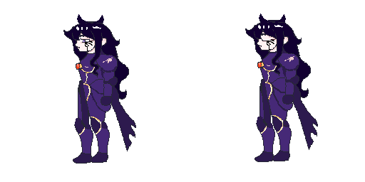

## Enemigos 

Los enemigos principales del videojuego dependerán del modo de juego seleccionado. En el modo Player vs Player local, el enemigo será el otro jugador, quien controlará a un personaje con las mismas posibilidades de ataque, defensa, movimiento y uso de modificadores de emociones. Este enfoque permite que el combate sea competitivo, técnico y basado en la habilidad de cada jugador. 

En el modo Player vs Environment, el enemigo será controlado por la inteligencia artificial. La IA representará a los rivales que se interponen en el camino del protagonista, incluyendo manifestaciones de pecados, emociones negativas o entidades demoníacas del inframundo. Estos enemigos no solo funcionarán como obstáculos de combate, sino también como una representación simbólica de los conflictos internos del personaje principal. 

En general, los enemigos cumplirán la función de poner a prueba las habilidades del jugador, tanto en el dominio de los controles como en el uso correcto de combos, bloqueos, saltos, ataques aéreos y modificadores emocionales.

